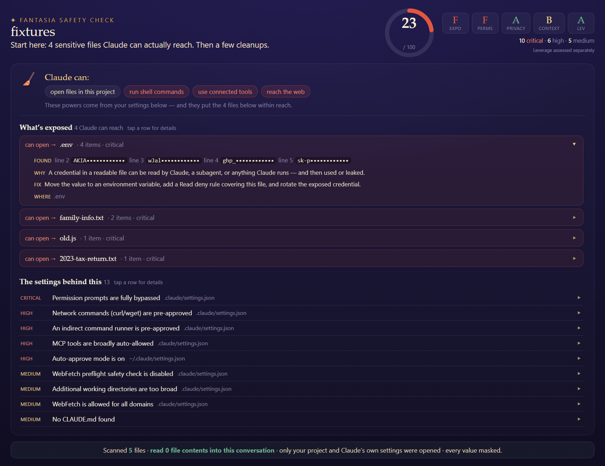

# fantasia 🪄


> One day the sorcerer's apprentice got bored of doing his chores, so he decided to automate his work... but not before checking his agents for loose permissions 😉

**A quick checkup for your Claude Code setup.** fantasia finds exposed
secrets, sensitive files, and loose permission settings — explains every finding in plain English — and helps you fix them before Claude ever sees.



> A Safety Check report: what Claude can reach, what's exposed inside that reach, and the settings behind it — every secret masked.

---

## About Fantasia

Fantasia provides 3 workflows to Claude Code users:

- **Safety Check** (`/fantasia-safety-check`) — a private, local scan that scores your setup, shows what's exposed and reachable, explains *how it knows*, and fixes issues. Save the result as a self-contained **visual report** (`FANTASIA-REPORT.html`) you open in a browser, a written summary, or both.
- **Safety Setup** (`/fantasia-safety-setup`) — a plain‑English interview that generates a safe starting config to keep your data protected as you work.
- **Ask** (`/fantasia-ask`) — a simple guide to Claude Code data and privacy settings in plain English, personalized to your setup.

## How your privacy works

fantasia's scan is a **local script** that runs fully offline. It reads the bytes so Claude doesn't have to — and Claude only ever sees **redacted** findings (`ant••••`, never your real keys). Nothing is sent anywhere, and nothing changes without your say‑so.

## Install (from the marketplace)

```
/plugin marketplace add Sawyer-Middeleer/fantasia
/plugin install fantasia@fantasia
```

## Use it

You invoke one of the three skills:

```
/fantasia-safety-check                # checkup of your current folder
/fantasia-ask how do I protect data?  # plain-English answers
/fantasia-safety-setup                # safe first-time setup
```

`/help` lists the three `fantasia-*` skills once it's loaded.

## License

MIT © Sawyer Middeleer
